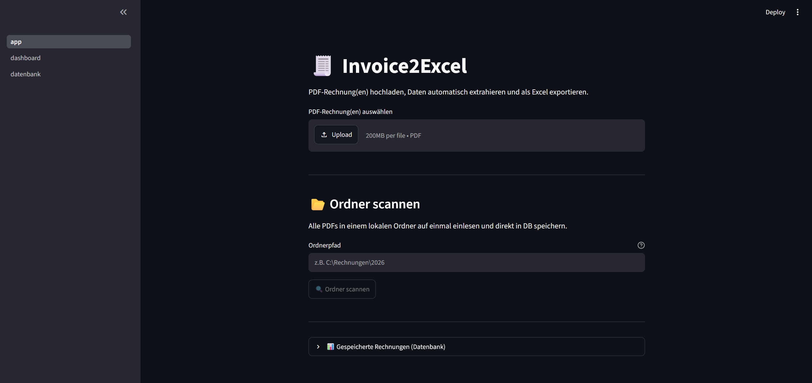
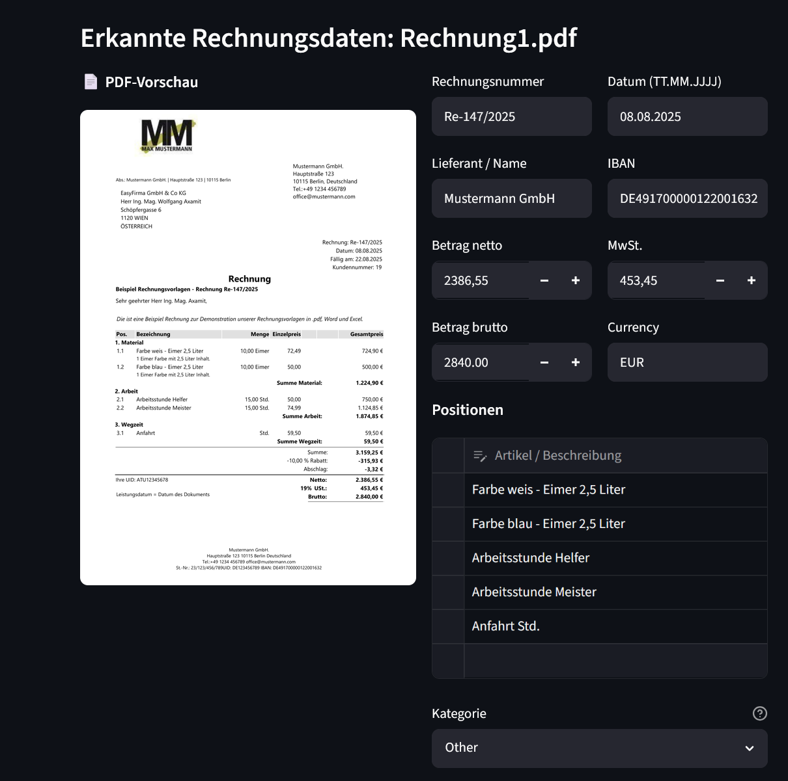
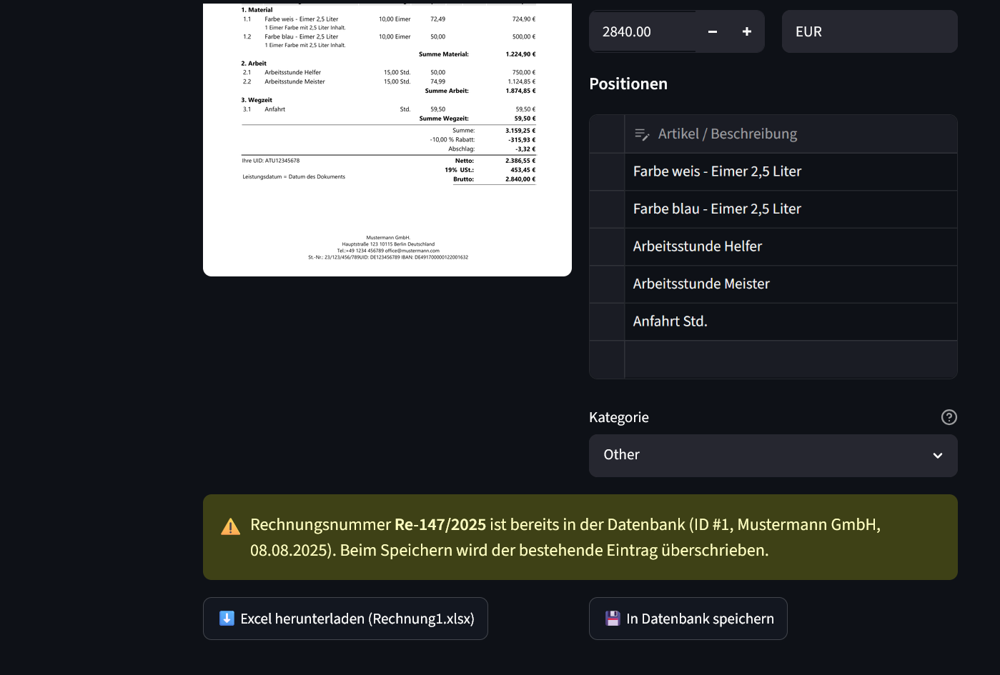
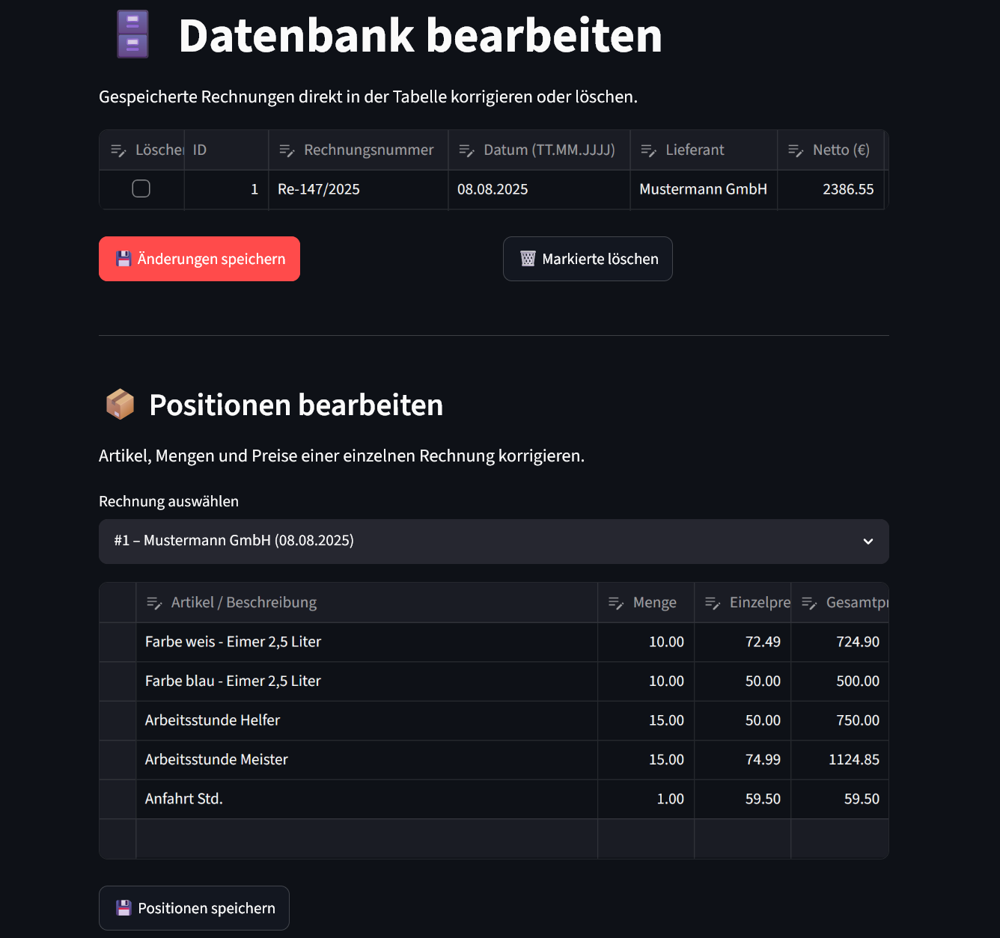

# Invoice2Excel
A Python application that automatically extracts invoice information from PDF documents and exports the data to Excel spreadsheets.
First Release:
[**Release**](../../releases/latest)
## GUI Screenshots

### Upload of invoice

### Datenbankansicht
